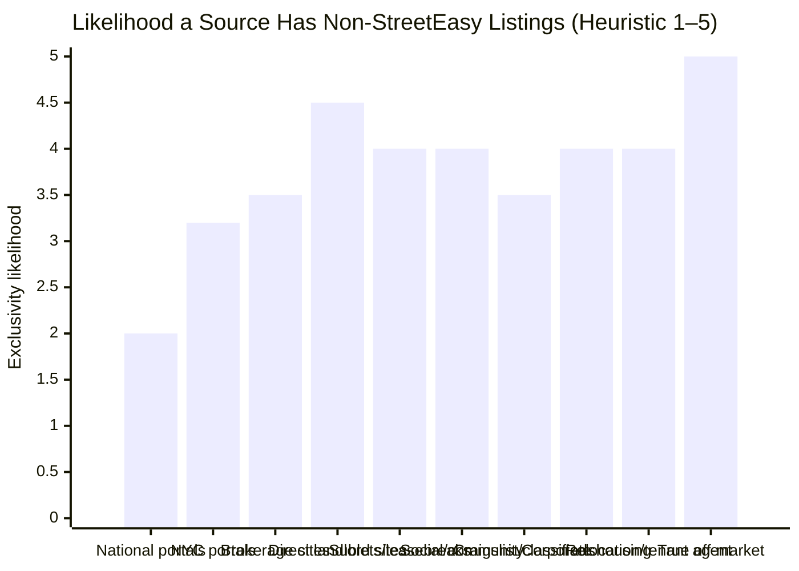
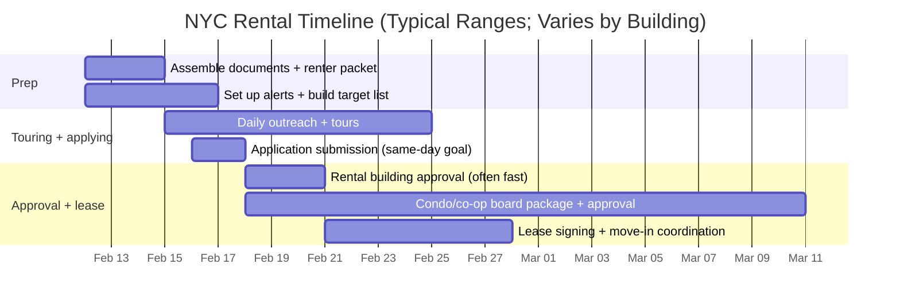

# Alternative Sources for NYC Apartment Rentals Beyond StreetEasy for Renters Up to $10,000 per Month

## Executive summary

StreetEasy is usually the deepest single pool for NYC rentals, but it is not a complete market—especially once you include (a) landlord-direct “no-fee” inventory living on management-company sites, (b) sublets/leasebreaks and 30+ day furnished housing, (c) broker “exclusive buildings” pages and brokerage-site inventory that may not be fully mirrored to StreetEasy, (d) true off-market (“pocket”) availability, and (e) community-driven postings where tenants, small landlords, and roommates advertise directly. NYC’s own housing agency explicitly recommends trying multiple apps/sites because “no single app will have everything,” and highlights word-of-mouth plus “talk to … doormen, supers, landlords, and/or your management company” as a practical way to uncover vacant units—exactly the pathways that create non-StreetEasy supply. citeturn18view4

For a renter budget up to $10,000/month (a range where condo/condop/co-op rentals, luxury rentals, and furnished corporate options become realistic), the **highest-yield alternatives** tend to be:

Landlord and management company direct leasing pages (TF Cornerstone, Durst, Rockrose, Two Trees, Glenwood, Brodsky, Rudin, Equity Residential, Avalon, LeFrak City, Related, etc.), because they can publish real-time availability and accept applications directly. citeturn7search1turn9search0turn9search3turn9search1turn7search2turn7search3turn8search0turn8search2turn8search3turn8search1turn7search0

NYC-centric “secondary” platforms with meaningful direct/management inputs (NYBits, RentHop, Nooklyn), which can surface buildings/units, leasing contacts, and no-fee inventory that you can then pursue directly. citeturn13search17turn2search1turn4search0

Sublet/leasebreak ecosystems (Leasebreak, Listings Project, Craigslist sublets/temporary, Sublet.com, niche lease-takeover apps), because these listings are often created by current tenants and may never hit StreetEasy’s core long-term listing flow. citeturn2search19turn11search19turn11search10turn11search3turn11search28

Brokerage sites and “exclusive rental buildings” pages (Compass, Corcoran, Elliman, BHS, Bond New York, Cooper & Cooper, etc.), which can contain brokerage-held exclusives, building relationships, and “exclusive buildings” collections, some of which will be marketed more heavily on brokerage-owned channels. citeturn4search1turn4search2turn4search3turn5search0turn16search2turn9search18turn16search3

Off-market access via a tenant’s agent + neighborhood specialist brokers + building waitlists (highest exclusivity by definition), especially for high-demand luxury and condo rentals that lease quickly and are sometimes circulated in-network before broad advertising. NYC DCWP confirms tenants *may choose to hire their own broker and pay broker fees*—the key legal lever for using a dedicated tenant agent to reach pocket inventory. citeturn18view0

This report provides a rigorous source map, comparative tables (exclusivity likelihood, fees, coverage, ease), concrete search settings for a $10k cap, outreach templates, and a repeatable operating plan.

## How non-StreetEasy inventory exists in NYC

StreetEasy has several structural reasons you should expect “leakage” (listings that exist but are not visible there):

Paid advertising and listing economics shape where agents and owners choose to publish. StreetEasy requires rental listings advertised on the platform to use a per-day “Rental Boost” plan (e.g., Basic $7/day, Plus $10/day, Premium $22/day), billed while the listing is active. citeturn17search3turn17search1 Owners/tenants can also post FRBO listings using fixed-price packages (e.g., $249 for 2 weeks or $299 for 2 weeks with featured status). citeturn17search2 These costs can create incentives to prioritize alternative channels (management sites; brokerage sites; internal lists; social/community posting), especially for “easy-to-rent” units.

NYC brokerage inventory is mediated by REBNY’s RLS ecosystem, but consumer visibility differs by outlet. REBNY describes the Residential Listing Service (RLS) as a sharing system for **exclusive listings among REBNY brokerage firms** and notes that the RLS “powers” listings on brokerage sites and third parties. citeturn2search0turn2search23 In practice, some consumer platforms may be closer to RLS syndication flows, while others depend more on direct agent uploads and commercial listing products—so the “same market” is not always mirrored perfectly.

A large share of NYC’s most “reliably no-fee” inventory sits with portfolio landlords and their direct leasing pipelines. Companies like TF Cornerstone (Manhattan, Brooklyn, and Long Island City), Durst (Manhattan and Queens), Rockrose (Manhattan and Long Island City), Two Trees (Brooklyn and Manhattan), and Glenwood (Manhattan and Riverdale) actively market and manage availability on their own sites. citeturn7search1turn9search0turn9search3turn9search1turn7search2 These pipelines can move faster than third-party syndication, and in some cases units are shown/leased directly from the owner’s inventory system.

Entire categories of “renting,” especially sublets and medium-term furnished, live outside the long-term broker listing flow. Leasebreak positions itself as a marketplace where leasebreaks/sublets generate “hundreds of leases found nowhere else in the city.” citeturn2search19 Listings Project runs an active NYC sublets channel. citeturn11search19 Craigslist has a huge “sublets & temporary” stream. citeturn11search10

Regulatory constraints also re-route supply. NYC’s Local Law 18 created a registration/verification regime for short-term rentals and requires platforms to stop processing unverified transactions. citeturn18view3 That pushes legitimate “temporary housing” into (a) 30+ day furnished providers (corporate housing, monthly rentals) and (b) traditional sublet/lease assignment structures—again, not always StreetEasy-first.

Finally, NYC’s own “Apartment Hunting Tips” emphasize that **word-of-mouth** and building-level conversations (neighbors, doormen, supers, landlords, management) are a common path to finding vacancies. citeturn18view4 Those channels produce the highest share of truly non-indexed opportunities.

## Comparative landscape and likelihood of exclusive non-StreetEasy listings

### Scoring framework used in this report

Because no public dataset can perfectly measure “exclusives not on StreetEasy,” the tables below use a transparent heuristic scoring approach oriented around *how inventory enters the channel*:

Exclusivity likelihood (1–5): How likely the channel is to surface listings that never appear on StreetEasy (or appear later). Higher when inventory is direct-to-landlord, tenant-posted, broker-network only, or intentionally withheld from broad public marketing.

Ease of use (1–5): Search UX, filtering, alerting, responsiveness.

Fees exposure: What you (as renter) commonly pay *because* of the channel (membership/subscription, broker engagement, board package fees, etc.). Note that NYC’s FARE Act materially changed broker-fee norms (details in the fees section).

### Category-level chart



### Major platforms and marketplaces beyond StreetEasy

| Source | What it’s best for | Typical NYC coverage | Exclusivity likelihood | Ease | Fees exposure | Why it can show non-StreetEasy inventory |
|---|---|---:|---:|---:|---:|---|
| Zillow / Trulia / HotPads (national) | Broad searching; map-based discovery; saved searches and filters | All boroughs (and beyond NYC) | Low–Medium | High | None to search | Some units are listed by owners/PMs directly on national portals even if not marketed on StreetEasy first; also useful for watching buildings and then going direct. Zillow also documents robust rental filters (price, bed, move-in date, amenities, pets, etc.). citeturn3search0turn3search4 |
| Apartments.com (national, multifamily-heavy) | Large building communities, verified listings, 3D tours; also “corporate furnished” filters | All boroughs | Low–Medium | High | None to search | Building/PM marketing can appear here in parallel with (or instead of) broker-driven unit-by-unit feeds. Apartments.com maintains NYC-specific pages and corporate-furnished categories. citeturn3search1turn12search11 |
| Realtor.com rentals | Broad inventory, especially outside core Manhattan | All boroughs + region | Low–Medium | High | None to search | Different syndication paths can surface pockets of inventory; good as a “sanity-check” aggregator. citeturn3search5 |
| Zumper | Fast-moving, “verified” style feed | NYC | Low–Medium | High | None to search | Another parallel syndication/verification stack; can show units that lag/lead other portals. citeturn3search2 |
| RentCafe (Yardi network) | Property-manager-driven listings; direct apply flows | NYC | Medium | Medium | None to search | RentCafe positions itself as an apartment search + application workflow; the network overlaps with management systems that may not prioritize StreetEasy. citeturn13search0turn13search16 |
| RentHop (NYC-centric) | Rapid refresh, “no-fee” hunting, responsiveness; broker + owner postings | NYC (all 5 boroughs) | Medium | High | None to search | RentHop explicitly markets large NYC coverage and supports no-fee search pages; it accepts listings from brokers/owners/management (channel diversification tends to produce some unique inventory). citeturn2search1turn2search8 |
| Nooklyn (NYC-centric) | Brooklyn-forward discovery + “buildings” view; neighborhood filtering | Brooklyn, Manhattan, Queens, Bronx | Medium | Medium | None to search | Nooklyn markets cross-borough listings and includes building-level browsing—useful for bypassing unit-level syndication and going straight to building pipelines. citeturn4search0turn4search16 |
| NYBits (NYC directory + listings) | No-fee focus; direct contact info; property manager directory | NYC + surrounding | Medium–High | Medium | None to search | NYBits states it aggregates listings from building managers, brokers, and private landlords, and provides a directory of owners/managers—high leverage for direct outreach. citeturn13search17turn13search1turn13search5 |
| CityRealty | Building/market context + rental inventory | NYC | Medium | Medium | None to search | Strong building orientation; helpful for identifying owners/management and then pivoting to direct leasing. citeturn5search3 |
| Craigslist (classifieds) | Sublets/temporary, small landlords, roommate situations, opportunistic posts | NYC | Medium–High | Medium–Low | None to search | Huge volume and fast posting; high uniqueness but higher scam/verification burden; “sublets & temporary” is an especially non-StreetEasy segment. citeturn11search10 |
| Stooper / niche sublet apps | Sublets, lease takeovers | NYC | High | Medium | App-specific | These tools specialize in the tenant-to-tenant segment that often never hits broker portals. citeturn11search28 |
| Listings Project | Curated sublets/short-term and some longer rentals | NYC | High | Medium | None to browse; newsletter model | Curated marketplace often created by tenants/owners, not brokers. citeturn11search19 |

### Brokerages and neighborhood firms likely to hold “exclusive” or non-syndicated pockets

A useful mental model: **Brokerage sites are not “better than StreetEasy,” but they are excellent at catching units that are (a) held as exclusives, (b) pushed to the brokerage’s own traffic first, (c) in an “exclusive buildings” program, or (d) simply not worth paying incremental ad costs for on every portal.**

| Brokerage / type | Notable positioning | Typical NYC footprint | Exclusivity likelihood | Ease | Why it can be unique |
|---|---|---:|---:|---:|---|
| Compass rentals | Large rental search with “exclusive Collections” positioning | NYC | Medium–High | High | Brokerage-owned demand funnel; can surface Compass-held exclusives and “collections.” citeturn4search1 |
| Corcoran rentals + “exclusive rental buildings” | Explicit “exclusive collection of residences” in Manhattan/BK/Queens | NYC | Medium–High | High | “Exclusive rental buildings” program can concentrate inventory on Corcoran channels. citeturn9search18turn4search2 |
| Douglas Elliman rentals | Large “luxury homes for rent” inventory | NYC | Medium | High | Strong at condo/coop luxury rentals; cross-market coverage. citeturn4search3 |
| Brown Harris Stevens rentals | NYC rentals search | NYC | Medium | Medium | Full-service luxury brokerage; sometimes highlights “coming soon.” citeturn5search0 |
| Nest Seekers rentals | High-end and broad geographies | NYC + beyond | Medium | Medium | International/luxury focus increases odds of niche high-budget inventory. citeturn5search9 |
| SERHANT rentals | Luxury-focused rentals page | NYC | Medium | Medium | Content-driven brokerage; can have unique inbound listings and internal promotion. citeturn5search2 |
| Bond New York (neighborhood strong + “exclusive buildings”) | States it represents “over 70 building exclusively”; markets “thousands … exclusively for rent” | Manhattan-centric + NYC | High | Medium | Building relationships can create exclusive “first call” access before broad syndication. citeturn16search6turn16search2 |
| Cooper & Cooper rentals (neighborhood strong) | Large rentals search tool | Manhattan + Brooklyn + Queens | Medium–High | Medium | Neighborhood brokerages often learn about move-outs early and control small-building exclusives. citeturn16search3 |

### Landlord and management company direct listings

For a $10k budget, this channel is often the single biggest incremental source beyond StreetEasy, because you can find: (a) luxury rentals, (b) “no-fee” buildings, (c) concessions, (d) units not yet syndicated, and (e) application/approval flows that are designed for speed.

| Landlord / manager (example) | What their site shows | Borough/neighborhood signals (from their own pages) | Exclusivity likelihood | Ease | Why it can be unique |
|---|---|---:|---:|---:|---|
| TF Cornerstone | “Featured apartments,” online apply + FAQ | Manhattan, Brooklyn & Long Island City; neighborhoods listed include LIC, FiDi, Hudson Yards, Hell’s Kitchen, Downtown Brooklyn, Chelsea, West Village, etc. citeturn7search1turn7search5 | High | High | Direct leasing inventory with named unit availability; can move faster than portal syndication. |
| The Durst Organization | Residential buildings; also building-specific availability pages | Durst states it owns/operates nearly 4,000 rental residences in Manhattan and Queens citeturn9search0 | High | Medium | Large owner pipeline; some buildings explicitly emphasize direct renting and broker limitations/disclaimers. citeturn9search8 |
| Rockrose | “Availabilities” with unit numbers and inquiry workflow | Manhattan and Long Island City citeturn9search3 | High | High | Real-time vacancy list; easy to inquire directly. |
| Two Trees | “Luxury apartments available now” | Brooklyn and Manhattan; neighborhoods include DUMBO, Williamsburg, Fort Greene, Downtown Brooklyn, etc. citeturn9search1 | High | High | Portfolio inventory + neighborhood concentration; strong direct funnel. |
| Glenwood Management | “See all apartments” + building list | Manhattan and Riverdale citeturn7search2 | High | Medium | Luxury owner with a distinct portfolio; can have vacancies not equally syndicated. |
| Brodsky | Availability list; “no fee luxury apartments” | Manhattan and Brooklyn; “availability” interface citeturn7search3 | High | High | Portfolio leasing; reduced broker intermediation. |
| Rudin | Residential properties list | Manhattan rental properties page citeturn8search0 | High | Medium | Large legacy owner; direct leasing relationships. |
| Equity Residential | NYC communities map and listings | Broad NYC footprint citeturn8search2turn8search18 | Medium–High | High | National owner/operator; units may appear across multiple portals, but direct contact can be faster. |
| AvalonBay Communities | NYC communities; floor plans and tours | NYC citeturn8search3turn8search15 | Medium–High | High | Similar to Equity; strong direct leasing workflow. |
| LeFrak City | Direct leasing site for a mega-complex | Queens (Corona) citeturn8search1 | High | High | Large complex with direct marketing + explicit republishing warnings. |
| Related Rentals | Luxury apartment portfolio | NYC + other major cities citeturn7search0 | Medium–High | High | Portfolio funnel; may cross-market units on multiple sites but often has direct availability tools. |

## Off-market and ‘pocket’ listings and how to access them

“Off-market” rentals in NYC typically aren’t mystical hidden units; they’re usually one of these operational realities:

A unit is known to a building (doorman/super/management) but not yet posted publicly. NYC HPD explicitly recommends being proactive by talking to neighbors, doormen, supers, landlords, and management to discover availability in a building. citeturn18view4

A broker has an exclusive and is quietly pre-qualifying tenants before blasting it widely (especially common for high-end condo rentals, where owners want a quick, clean deal).

A unit is a condo/co-op sublet where the owner is testing price/tenant quality before taking on board package effort.

A unit is being marketed inside a brokerage first (agent email blasts, internal Slack/WhatsApp, “exclusive buildings” programs).

### Practical access routes

Work with a true tenant’s agent (if you want maximum off-market reach). NYC’s broker-fee law (FARE Act) does **not** prohibit tenants from choosing to hire their own broker and paying broker fees; it prohibits landlords’ agents/listing agents from charging tenants. citeturn18view0 This makes “hire a tenant agent” a legitimate strategy when access and speed matter more than minimizing effort.

Target neighborhood brokers instead of generalists. NYC HPD suggests that if you know the neighborhood you want, “it’s usually best to find a broker based there.” citeturn18view4 Even without a specific neighborhood, you can still run this logic by selecting 2–3 “clusters” (e.g., West Side Manhattan, Downtown Manhattan, NW Brooklyn, LIC/Greenpoint) and contacting specialists in each.

Build “building-list” pipelines. For $10k/month, it is often more effective to pick 20–40 buildings that fit your quality bar (doorman/amenities/commute) and then: (a) check the owner/management site daily, (b) email leasing for “upcoming availability,” (c) ask to be placed on waitlists.

Use owner/manager directories to create your call list. NYBits maintains a directory of NYC property managers (leasing managers) and describes the boundary between managers/brokers/in-house rental offices as sometimes “fuzzy,” which is exactly why the list is useful: it’s a map of who can actually say “yes” to an application. citeturn13search5

## Search strategies and recommended settings for a $10,000 cap

### Use a “two-lane” search design

Lane A (fast visibility): Run saved searches across 3–5 platforms whose filters you like (e.g., StreetEasy + Zillow + RentHop + NYBits + one brokerage site). Zillow’s help documentation describes filtering by price, beds, home type, pet policy, move-in date, amenities, etc., which is the right baseline for a saved-search workflow. citeturn3search0

Lane B (direct inventory): Maintain a separate, deliberate pipeline of landlord/management sites and brokerage “exclusive buildings” pages, because these are the highest-yield sources for non-StreetEasy inventory (see the tables above). citeturn7search1turn9search0turn9search3turn9search18

### Recommended search settings and filters

Price: Set max to $10,000; consider a “noise-reducing” minimum (e.g., $5,000–$6,000) when you want to focus on luxury inventory and avoid scrolling through thousands of units. You can drop the minimum when you shift to value-hunting or specific neighborhoods.

“Fee” framing post-FARE Act: Since June 11, 2025, NYC’s FARE Act prohibits a landlord’s agent (including listing agents) from charging broker fees to prospective tenants and requires clear disclosure of all tenant fees in advertisements/listings. citeturn18view0 In practice, you should treat any “tenant broker fee required” language with caution unless you are explicitly hiring that broker as your representative.

Direct-leasing filters: On management sites, prioritize filters like “Available now/soon,” “Net effective vs base rent,” “Concessions,” and “Apply” workflows. Brodsky’s availability page, for example, shows availability dates and promotions like reduced security deposits for qualified applicants. citeturn7search3

Short-term/furnished compliance: If you are looking at “short-term” housing, prioritize providers that explicitly support 30+ day stays (a common compliance lane under NYC’s short-term rental constraints). June Homes explicitly describes offering “short-term rentals starting from just 30 days” and notes compliance framing. citeturn12search3 Blueground indicates minimum stays typically around 30 nights for Manhattan furnished apartments. citeturn12search21

### High-leverage Google queries to surface non-StreetEasy inventory

Use these query patterns to find direct leasing pages, unit-level availability feeds, and “apply now” portals (replace neighborhoods/building names freely):

```text
site:tfc.com availability "New York" 2 bed
site:durst.org residential "availability"
site:rockrose.com availabilities "Long Island City"
site:twotreesny.com availabilities apartments
site:glenwoodnyc.com "View Apartment" "Monthly Price"
site:nybits.com "Active listings" "rentals"
site:leasebreak.com "short-term rentals" "Upper West Side"
site:listingsproject.com "New York City" sublet $8000
"apply online" "luxury apartments" "Long Island City" "no fee"
"exclusive rental buildings" Manhattan site:corcoran.com
```

If you want to find “broker-only” style mentions without committing to a tenant agent, add terms that correlate with pre-market behavior:

```text
"coming soon" "for rent" "New York, NY" site:compass.com
"exclusive" "for rent" site:bondnewyork.com
"off market" "rental" "NYC" "agent"
```

## Practical steps and outreach templates

### Operational checklist to run a high-speed NYC search

Prepare a “renter packet” in advance. You are optimizing for *time-to-apply* because many good units disappear quickly; portfolio landlords and luxury buildings often have structured screening and can move fast (TF Cornerstone even itemizes documentation requirements in its application FAQ). citeturn15search2

Build a management-company target list. Start with the owners/managers in this report (TF Cornerstone, Durst, Rockrose, Two Trees, Glenwood, Brodsky, Rudin, Equity, Avalon, Related, LeFrak City). citeturn7search1turn9search0turn9search3turn9search1turn7search2turn7search3turn8search0turn8search2turn8search3turn7search0turn8search1

Subscribe to alerts and newsletters. NYBits, brokerage sites, and corporate housing providers often support saved searches or email capture; use them as signal, then go direct.

Use a weekly cadence for “off-market asks.” Once per week, email or text your broker/leasing contacts asking, “What’s coming up in the next 7–14 days under $10k?”

### Contact templates

Template for management company leasing office (direct listings)
```text
Subject: Inquiry + upcoming availability (budget up to $10,000/mo)

Hi [Leasing Team Name],

I’m looking to rent in NYC with a monthly budget up to $10,000.
I’m flexible on unit type and location (no specific constraints yet), and I can move quickly for the right apartment.

Could you share:
1) Any current availability you recommend under $10k, and
2) Any upcoming vacancies expected in the next 2–4 weeks (even if not posted yet)?

I can provide a complete application package immediately and can tour on short notice.
Best contact for scheduling: [phone] / [email]

Thank you,
[Your name]
```

Template for a neighborhood broker (requesting off-market / “coming soon”)
```text
Subject: Tenant search – budget up to $10k – any “coming soon” or quiet listings?

Hi [Agent Name],

I’m starting a NYC rental search (budget up to $10,000/month). I’m flexible on neighborhood/bedrooms and can move quickly.

Do you have:
- Any exclusives, “coming soon,” or off-market rentals you’re aware of under $10k?
- Any landlord/building relationships where you expect near-term availability?

If helpful, I can send a quick renter profile + documents today.
What’s the best way to see your upcoming inventory (email list, text alerts, etc.)?

Thanks,
[Your name] | [phone]
```

Template to post in a neighborhood/community group (sublets + direct leads)
```text
Hi all — I’m looking for an NYC rental with a budget up to $10,000/month.
Flexible on borough/neighborhood and open to:
- lease takeovers/leasebreaks
- furnished 30+ day rentals
- landlord-direct units

If you know of an upcoming vacancy in your building or are ending a lease soon, please DM me with:
Address (or cross streets), rent, move-in date, lease length, and any building requirements.

Happy to move quickly and provide documents immediately. Thank you!
```

## Typical fees, application requirements, and timelines in 2026

### Core legal cost guardrails you should know

Security deposits are capped at one month’s rent by New York’s HSTPA, and DHCR states it is unlawful for an owner to ask for additional money beyond that deposit cap; DHCR also flags “room reservation charges or deposits” (key money) as unlawful. citeturn18view1 This matters because some non-traditional channels (Craigslist, social groups) can involve requests for upfront “holds”—you should treat these as a major red flag.

Application/background check fees are capped: DHCR’s fees fact sheet states that reasonable fees for a background check “cannot exceed $20 per tenant subject to the background check.” citeturn18view2 TF Cornerstone’s own application FAQ mirrors the $20 fee for each applicant and guarantor. citeturn15search2

Broker fees changed in NYC in mid-2025: DCWP’s FAQ explains that Local Law 119 of 2024 (FARE Act) took effect June 11, 2025; it prohibits landlords from passing on their agents’ fees to prospective tenants, prohibits a landlord’s agent/listing agent from charging fees to prospective tenants, and requires disclosure of all fees tenants must pay. citeturn18view0 DCWP also clarifies that tenants may still choose to hire their own broker and pay broker fees (but no one can condition a rental on you hiring a broker). citeturn18view0

Short-term rentals: NYC’s Office of Special Enforcement explains Local Law 18’s registration/verification scheme and that booking platforms must stop processing unverified transactions, with enforcement starting September 5, 2023. citeturn18view3 This is why “furnished monthly” and “30+ day” providers (Blueground, June Homes, etc.) are often the safer path for temporary needs. citeturn12search21turn12search3

### Condo/co-op rental timelines and extra fees

Condo/co-op rentals can involve board packages, building rules, and longer lead times than a straightforward rental building. GroundIQ notes condo/co-op rental (sublet) approvals can vary from about a week to closer to a month or longer, and that condos are often easier than co-ops. citeturn10search4 ELIKA similarly cites a 15–45 day approval range for co-op/condo rental applications in NYC. citeturn10search14

Expect possible building move-in/move-out fees or deposits, and recognize that certain condo/co-op “board” charges may not behave like standard rental application fees. StreetEasy’s rental-fees overview explicitly notes the $20 cap applies in NYS but “doesn’t necessarily apply if the fee is being paid to a co-op or condo board.” citeturn10search1 (Treat this as a planning flag; confirm in writing per-building.)

### Typical end-to-end rental timeline



## Representative links, recommended searches, and groups to join

Because you asked for direct links, they are provided in code blocks.

### Direct landlord/management availability pages

```text
https://tfc.com/
https://www.durst.org/properties/residential
https://rockrose.com/availabilities/
https://www.twotreesny.com/availabilities/apartments
https://www.glenwoodnyc.com/
https://brodsky.com/rentals
https://www.rudin.com/residential_properties
https://www.relatedrentals.com/
https://www.equityapartments.com/new-york-city-apartments
https://www.avaloncommunities.com/new-york/new-york-city-apartments/
https://www.lefrakcity.com/
```

### NYC-centric platforms that can surface non-StreetEasy leads

```text
https://www.nybits.com/search/
https://www.nybits.com/managers/residential_property_managers.html
https://www.renthop.com/
https://nooklyn.com/rentals
https://www.leasebreak.com/
https://www.listingsproject.com/real-estate/new-york-city/sublets
https://www.stooper.com/
https://newyork.craigslist.org/search/sub
```

### Brokerage sites and “exclusive buildings” style pages

```text
https://www.compass.com/for-rent/new-york-ny/
https://www.corcoran.com/search/for-rent/regionId/1
https://www.corcoran.com/manhattan-exclusive-rental-buildings
https://www.elliman.com/rentals/new-york-ny
https://www.bhsusa.com/for-rent/new-york-city
https://www.bondnewyork.com/nyc_apartment_rentals
https://www.coopercooper.com/Rent
```

### Corporate / furnished 30+ day options

```text
https://www.theblueground.com/m/furnished-apartments/new-york-ny-usa/a/manhattan
https://junehomes.com/residences/new-york-city-ny?hometype=all
https://www.anyplace.com/sublet/manhattan-new-york-city
https://www.furnishedquarters.com/
https://www.churchillliving.com/
https://www.sublet.com/new-york-city
```

### Social/community sources to mine carefully

These can be high-uniqueness but require strong scam-avoidance and verification discipline.

```text
https://www.facebook.com/groups/realgypsyhousing/about/
https://www.facebook.com/groups/935448723167488/forsaleposts/
https://www.reddit.com/r/NYCapartments/
https://nextdoor.com/pages/real-estate-new-york-city-ny-14/
```

If you want a curated example of the kind of neighborhood-specific roommate/rental groups that exist, Curbed describes the “Young Females: New York City, NYC- Apartments, Sublets, Roommates” Facebook group as a large, active pipeline. citeturn11search12

### NYC-specific official starting point (good baseline guidance)

```text
https://www.nyc.gov/site/hpd/services-and-information/apartment-hunting-tips.page
```

NYC HPD’s key guidance—use multiple sites, neighborhood brokers, word-of-mouth, classifieds, and building-level conversations—is effectively a blueprint for finding non-StreetEasy inventory. citeturn18view4